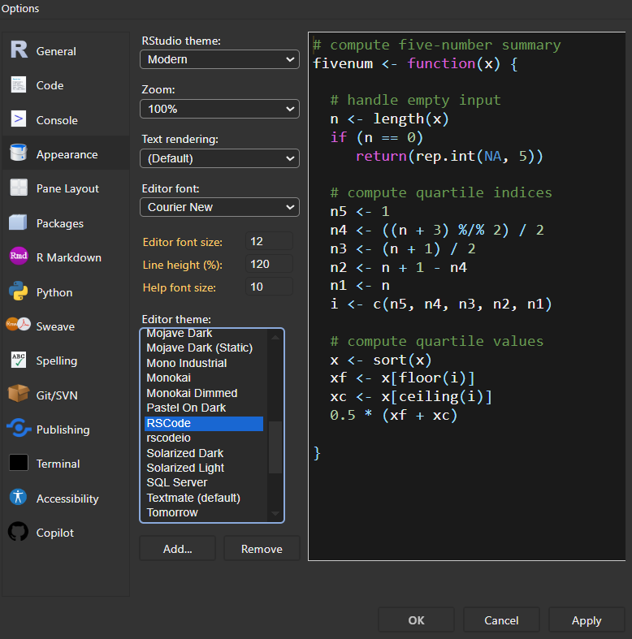

# VSCode-Style Theme for RStudio
A dark theme for the RStudio IDE. Based on the [Monokai Dimmed Theme for RStudio](https://github.com/thedbcooper/rstudio-theme-monokai-dimmed)

## Install:

1. download file from this website [RSCode.rstheme](https://github.com/yuki-961004/RSCode/blob/main/RSCode.rstheme)
2. Open RStudio -> Tools -> Global Options
3. Appearance -> Add... -> Find and Select `RSCode.rstheme`

    

## Other Settings
1. Open RStudio -> Tools -> Global Options
2. Code -> General -> | √ Show whitespace characters |
3. Code -> Display -> Syntax -> | √ Hightlight R function calls | √ Use rainbow parentheses |

    

